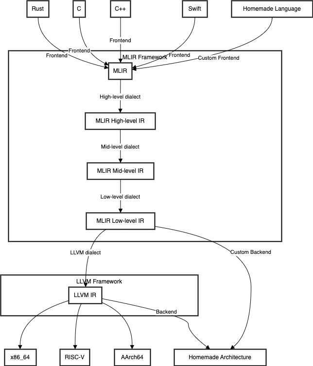
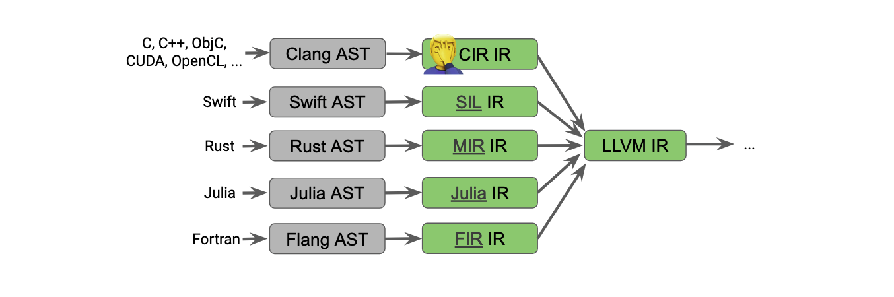
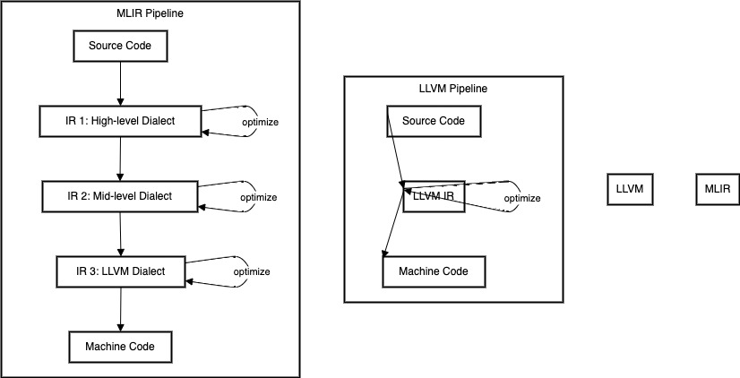
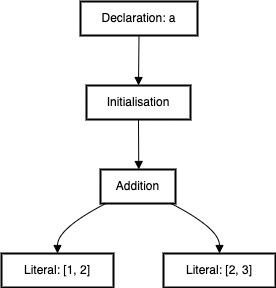
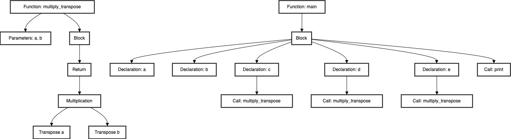
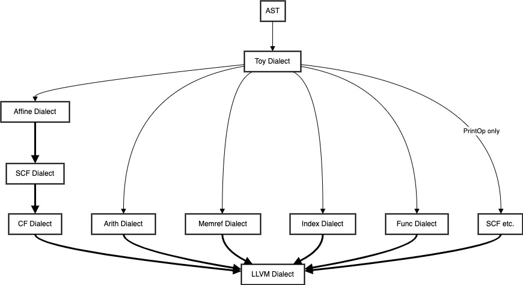
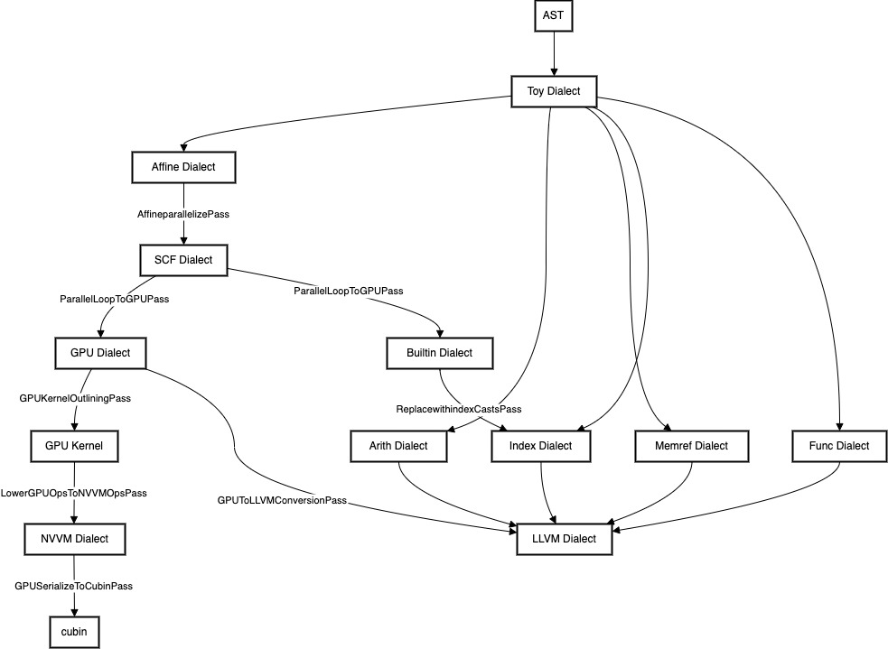

## MLIR — Framework for Compiler Development

[MLIR](https://mlir.llvm.org/) (Multi-Level Intermediate Representation) is a groundbreaking framework revolutionizing compiler creation. It provides a flexible platform for defining intermediate representations, facilitating conversions, and implementing optimizations.

### MLIR and LLVM — A Comparative Analysis

LLVM has long been the cornerstone of compiler development. Its primary innovation was the introduction of a unified intermediate representation, the LLVM IR. This approach significantly reduced the complexity of compiler development:

1. For new programming languages:

   - Developers only need to implement the conversion from source code to LLVM IR.
   - Existing LLVM assets handle the conversion from LLVM IR to various machine languages (e.g., x86, RISC-V).

2. For new processor architectures:

   - Only the conversion from LLVM IR to the new machine language requires implementation.
   - All languages that utilise LLVM IR (C/C++, Swift, Rust, etc.) become compatible with the new processor.

MLIR builds upon these concepts, offering enhanced flexibility and power for modern compiler development needs.

```c
#include <stdio.h>
#include <stdlib.h>
#include <string.h>

#define MAX_NAME_LENGTH 50

typedef struct CompilerFramework CompilerFramework;
typedef struct LLVM LLVM;
typedef struct MLIR MLIR;

/* Function pointer types for virtual methods */
typedef void (*ConvertToIRFunc)(CompilerFramework*, const char*);
typedef void (*OptimiseIRFunc)(CompilerFramework*);
typedef void (*GenerateMachineCodeFunc)(CompilerFramework*, const char*);

struct CompilerFramework {
    char name[MAX_NAME_LENGTH];
    char ir_type[MAX_NAME_LENGTH];
    ConvertToIRFunc convert_to_ir;
    OptimiseIRFunc optimise_ir;
    GenerateMachineCodeFunc generate_machine_code;
};

struct LLVM {
    CompilerFramework base;
};

struct MLIR {
    CompilerFramework base;
    void (*define_custom_ir)(MLIR*);
    void (*convert_between_irs)(MLIR*, const char*, const char*);
};

/* CompilerFramework methods */
void compiler_framework_init(CompilerFramework* cf, const char* name, const char* ir_type) {
    strncpy(cf->name, name, MAX_NAME_LENGTH - 1);
    cf->name[MAX_NAME_LENGTH - 1] = '\0';
    strncpy(cf->ir_type, ir_type, MAX_NAME_LENGTH - 1);
    cf->ir_type[MAX_NAME_LENGTH - 1] = '\0';
}

void compiler_framework_convert_to_ir(CompilerFramework* cf, const char* source_code) {
    printf("Converting source code to IR for %s\n", cf->name);
}

void compiler_framework_optimise_ir(CompilerFramework* cf) {
    printf("Optimising IR for %s\n", cf->name);
}

void compiler_framework_generate_machine_code(CompilerFramework* cf, const char* target_architecture) {
    printf("Generating machine code for %s targeting %s\n", cf->name, target_architecture);
}

/* LLVM methods */
void llvm_convert_to_ir(CompilerFramework* cf, const char* source_code) {
    printf("LLVM-specific implementation of convert_to_ir\n");
}

LLVM* llvm_create(void) {
    LLVM* llvm = (LLVM*)malloc(sizeof(LLVM));
    if (!llvm) {
        fprintf(stderr, "Memory allocation failed\n");
        exit(1);
    }
    compiler_framework_init(&llvm->base, "LLVM", "Single-level IR");
    llvm->base.convert_to_ir = llvm_convert_to_ir;
    llvm->base.optimise_ir = compiler_framework_optimise_ir;
    llvm->base.generate_machine_code = compiler_framework_generate_machine_code;
    return llvm;
}

/* MLIR methods */
void mlir_convert_to_ir(CompilerFramework* cf, const char* source_code) {
    printf("MLIR-specific implementation of convert_to_ir\n");
}

void mlir_define_custom_ir(MLIR* mlir) {
    printf("Defining custom IR for MLIR\n");
}

void mlir_convert_between_irs(MLIR* mlir, const char* source_ir, const char* target_ir) {
    printf("Converting from %s to %s in MLIR\n", source_ir, target_ir);
}

MLIR* mlir_create(void) {
    MLIR* mlir = (MLIR*)malloc(sizeof(MLIR));
    if (!mlir) {
        fprintf(stderr, "Memory allocation failed\n");
        exit(1);
    }
    compiler_framework_init(&mlir->base, "MLIR", "Multi-level IR");
    mlir->base.convert_to_ir = mlir_convert_to_ir;
    mlir->base.optimise_ir = compiler_framework_optimise_ir;
    mlir->base.generate_machine_code = compiler_framework_generate_machine_code;
    mlir->define_custom_ir = mlir_define_custom_ir;
    mlir->convert_between_irs = mlir_convert_between_irs;
    return mlir;
}

/* Memory cleanup functions */
void llvm_destroy(LLVM* llvm) {
    free(llvm);
}

void mlir_destroy(MLIR* mlir) {
    free(mlir);
}

int main(void) {
    LLVM* llvm = llvm_create();
    MLIR* mlir = mlir_create();

    llvm->base.convert_to_ir(&llvm->base, "LLVM source code");
    mlir->base.convert_to_ir(&mlir->base, "MLIR source code");
    mlir->define_custom_ir(mlir);
    mlir->convert_between_irs(mlir, "Source IR", "Target IR");

    llvm_destroy(llvm);
    mlir_destroy(mlir);

    return 0;
}
```

The code above illustrates the differences between LLVM and MLIR, highlighting MLIR's additional capabilities in handling multiple levels of intermediate representations and conversions between them.



The architecture represents MLIR's enhanced capabilities in handling various levels of abstraction and its interoperability with LLVM, whilslt maintaining the ease of adding new languages or target architectures.

+ MLIR's ability to handle multiple levels of IR (High, Mid, Low).
+ The transition from MLIR to LLVM IR.
+ The flexibility to create custom frontends for new languages.
+ The option to generate code directly from MLIR for custom architectures, bypassing LLVM IR if desired.
+ The continued use of LLVM's backend infrastructure for common architectures.

**High-Level IR — Beyond LLVM's Limitations**

LLVM's utility is undeniable. However, LLVM IR operates at a level close to machine language, which presents certain constraints. Many languages require high-level intermediate representations to capture complex information that LLVM IR cannot express effectively. These high-level IRs typically handle:

+ Advanced type systems
+ Lifetime analysis
+ Language-specific abstractions
+ Semantic information

This trend towards custom high-level IRs is gaining traction in compiler design. It allows for:

+ More precise static analysis
+ Language-specific optimisations
+ Easier implementation of source-level debugging
+ Better preservation of high-level semantics

MLIR addresses this need by providing a framework for creating and managing multiple levels of IR, including high-level representations. The approach bridges the gap between source languages and LLVM IR, offering a more flexible and powerful compilation pipeline.

```c
typedef struct {
    char* name;
    void (*parse_ast)(const char* source);
    void (*type_check)(void);
    void (*optimise)(void);
    void (*lower_to_llvm_ir)(void);
} HighLevelIR;

HighLevelIR* create_high_level_ir(const char* name) {
    HighLevelIR* ir = malloc(sizeof(HighLevelIR));
    if (!ir) {
        fprintf(stderr, "Memory allocation failed\n");
        exit(1);
    }
    ir->name = strdup(name);
    // Initialize function pointers
    return ir;
}

void destroy_high_level_ir(HighLevelIR* ir) {
    free(ir->name);
    free(ir);
}
```

The code above exemplifies a basic framework for a high-level IR, showcasing the additional capabilities beyond what LLVM IR typically provides.

```llvm
; Block 45 (predecessor: block 42)
45:
  ; Extract the second element (index 1) from the struct %6
  %ptr = extractvalue { ptr, ptr, i64, [1 x i64], [1 x i64] } %6, 1

  ; Calculate the address of the double at index %43
  %elementPtr = getelementptr double, ptr %ptr, i64 %43

  ; Load the double from the calculated address
  %value = load double, ptr %elementPtr, align 8

  ; Call printf with the loaded value
  %printResult = call i32 (ptr, ...) @printf(ptr @formatSpecifier, double %value)

  ; Increment the loop counter
  %nextIndex = add i64 %43, 1

  ; Jump back to the loop header (block 42)
  br label %42
```

### Challenges of High-Level Intermediate Representations

The landscape of intermediate representations above LLVM IR presents several issues:

1. Lack of standardisation:

   Each language typically implements its own high-level IR, leading to:
   - Duplication of effort across language communities
   - Minimal knowledge sharing between implementations

2. Redundant implementations:

   Similar concepts are often reimplemented in multiple languages, resulting in:
   - Increased development overhead
   - Potential inconsistencies in optimisation strategies

3. Limited representation for specialised hardware:

   LLVM IR's design favours traditional CPU architectures, causing difficulties when targeting:
   - GPUs
   - AI accelerators
   - Other novel processing units

This fragmentation hampers:

   - Cross-language optimisation techniques
   - Efficient targeting of diverse hardware platforms
   - Collaborative advancement of compiler technologies

MLIR aims to address these challenges by providing a unified framework for creating and managing multiple levels of IR, fostering:

   - Reusable dialect implementations
   - Hardware-specific representations
   - Improved interoperability between different language ecosystems

```c
typedef struct {
    const char* name;
    void (*generate_ir)(const char* source);
    void (*optimise)(void);
    void (*lower_to_hardware_specific_ir)(const char* target);
} CustomIR;

CustomIR* create_custom_ir(const char* name) {
    CustomIR* ir = malloc(sizeof(CustomIR));
    if (!ir) {
        fprintf(stderr, "Memory allocation failed\n");
        exit(1);
    }
    ir->name = strdup(name);
    // Initialize function pointers
    return ir;
}

void destroy_custom_ir(CustomIR* ir) {
    free((void*)ir->name);
    free(ir);
}
```

The code above illustrates a framework for creating custom IRs, addressing the need for flexibility in representing language-specific and hardware-specific concepts.


_Modern Languages Investments in High Level IRs [CGO 2020: International Symposium on Code Generation and Optimization](https://docs.google.com/presentation/d/11-VjSNNNJoRhPlLxFgvtb909it1WNdxTnQFipryfAPU/edit?pli=1#slide=id.g7d334b12e5_0_775)_

MLIR is an adaptable compiler platform, enabling the definition, combination, and reuse of diverse intermediate representations beyond LLVM IR. Its flexibility allows for the creation of custom IRs tailored to specific languages or hardware architectures, whilst facilitating the sharing and integration of IR components across different compiler projects.

**Optimisation — Preserving High-Level Semantics**

LLVM IR's low-level nature can obscure high-level semantic information, limiting optimisation potential. MLIR addresses this by allowing optimisations across multiple levels of abstraction, preserving and leveraging high-level semantics.

```c
typedef struct {
    void (*matrix_multiply)(double* A, double* B, double* C, int m, int n, int p);
    void (*optimise_high_level)(void* ir);
    void (*optimise_low_level)(void* ir);
} OptimisationPipeline;

void high_level_optimise(void* ir) {
    // Recognise and optimise matrix multiplication patterns
}

void low_level_optimise(void* ir) {
    // Apply traditional low-level optimisations
}

OptimisationPipeline create_pipeline(void) {
    OptimisationPipeline pipeline = {
        .matrix_multiply = NULL,  // Implement matrix multiplication
        .optimise_high_level = high_level_optimise,
        .optimise_low_level = low_level_optimise
    };
    return pipeline;
}
```

The code above demonstrates MLIR's capability to apply optimisations at different abstraction levels, preserving high-level operations like matrix multiplication for more effective optimisation.



### Crafting Custom Languages with MLIR

MLIR's power lies in its ability to define and manipulate multiple intermediate representations, known as Dialects. MLIR provides a standard library of pre-defined Dialects, serving as building blocks for compiler development. These Dialects form a spectrum of abstractions, from high-level language concepts to low-level machine instructions.

The compilation process in MLIR involves a series of transformations between these Dialects, progressively lowering the code representation until it reaches machine language. This approach offers:

+ Flexibility in language design
+ Reusability of existing optimisation passes
+ Seamless integration with established compilation pipelines

Developers can leverage these standard Dialects or create custom ones, tailoring the compilation process to their specific language requirements. This modularity facilitates the creation of new languages whilst benefiting from MLIR's robust infrastructure.

Refer to the MLIR documentation for a list of [Standard Dialects](https://mlir.llvm.org/docs/Dialects/).

### Toy Tutorial — Crafting a Custom Language with MLIR

The Toy Tutorial exemplifies the creation of a straightforward language using MLIR. This example, though basic, illustrates fundamental concepts in language design and MLIR's capabilities.

Key features of the Toy language:

+ Universal Tensor representation for all values
+ User-defined functions supporting generic Tensor shapes
+ Built-in functions such as `transpose` and `print`
+ Automatic reshaping and type inference

```toy:example.toy
# Tensor type creation
def create_tensor_type(name, shape) {
  return [name, shape];
}

# Function definition constructor
def create_function(name, param_types, return_type, body) {
  return [name, param_types, return_type, body];
}

# Type inference mechanism (simplified)
def infer_type(expr) {
  # In practice, this would involve complex analysis
  return create_tensor_type("inferred", [2, 2]);
}

# Source code parsing (placeholder)
def parse(source) {
  print("Parsing source code");
  # Actual parsing logic omitted
}

# MLIR lowering process (placeholder)
def lower_to_mlir() {
  print("Lowering to MLIR");
  # MLIR lowering implementation omitted
}

# Optimisation phase (placeholder)
def optimise() {
  print("Optimising MLIR");
  # Optimisation strategies omitted
}

# Code generation phase (placeholder)
def codegen() {
  print("Generating final code");
  # Code generation process omitted
}

# Compiler pipeline simulation
def main() {
  var tensor_type = create_tensor_type("float", [2, 3]);
  var func = create_function("matrix_multiply", [tensor_type, tensor_type], tensor_type, "matrix multiplication logic");
  
  parse("source code for matrix multiplication");
  var result_type = infer_type(func);
  lower_to_mlir();
  optimise();
  codegen();
  
  print("Matrix multiplication function compiled");
}
```

The example above demonstrates:

+ Tensor type representation
+ Function definitions with specified parameter and return types
+ A basic compiler pipeline including parsing, type inference, MLIR lowering, optimisation, and code generation

The actual implementation would require intricate logic for each compiler phase, utilising MLIR's dialect system to gradually transform high-level Toy constructs into machine code. The example shows how a Toy language compiler might look like using MLIR's capabilities.

### Crafting a Parser for Custom Languages

The initial step in creating a custom language involves developing a parser. This component transforms the raw source code, practically a string, into a structured data representation.

Given the typically recursive nature of source code, the resulting data structures are invariably tree-like. These structures are known as Abstract Syntax Trees (ASTs).

Consider this simple Toy language example:

```toy
var a = [1, 2] + [2, 3];
```

The corresponding AST would resemble:



For more complex code, such as the `example.toy` provided earlier, the AST becomes more intricate:



The AST representation captures the structure and relationships within the source code, serving as a foundation for subsequent compilation phases such as semantic analysis, optimisation, and code generation.

The parser's role in creating this AST is fundamental to the entire compilation process, as it transforms the linear text of the source code into a hierarchical structure that mirrors the logical organisation of the program. This structured representation facilitates all downstream compilation tasks, making the parser a critical component in language implementation.

### Defining an AST-Representing Intermediate Representation

In the MLIR framework, the initial step after parsing is to define an intermediate representation (IR) that closely mirrors the Abstract Syntax Tree (AST). The approach, known as creating Input Dialects, allows for a gradual lowering of the code's semantics towards machine-level instructions.

For the Toy language, we define a `Toy Dialect` with the following core instructions:

1. `ConstantOp`: For literal values
2. `AddOp`: Addition operation
3. `FuncOp`: Function definition
4. `ReturnOp`: Function return
5. `PrintOp`: Print operation
6. `GeneralCallOp`: Function call
7. `MulOp`: Multiplication operation
8. `ReshapeOp`: Tensor reshaping
9. `TransposeOp`: Tensor transposition
10. `CastOp`: Type casting

This set of operations represents the capabilities of the Toy language.

Here's how the `example.toy` code is expressed using the Toy Dialect in MLIR:

```mlir
{
  toy.func private @multiply_transpose(%arg0: tensor<*xf64>, %arg1: tensor<*xf64>) -> tensor<*xf64> {
    %0 = toy.transpose(%arg0 : tensor<*xf64>) to tensor<*xf64>
    %1 = toy.transpose(%arg1 : tensor<*xf64>) to tensor<*xf64>
    %2 = "toy.mul"(%0, %1) : (tensor<*xf64>, tensor<*xf64>) -> tensor<*xf64>
    toy.return %2 : tensor<*xf64>
  }
  toy.func @main() {
    %0 = "toy.constant"() {value = dense<[[1.000000e+00, 2.000000e+00, 3.000000e+00], [4.000000e+00, 5.000000e+00, 6.000000e+00]]> : tensor<2x3xf64>} : () -> tensor<2x3xf64>
    %1 = "toy.constant"() {value = dense<[1.000000e+00, 2.000000e+00, 3.000000e+00, 4.000000e+00, 5.000000e+00, 6.000000e+00]> : tensor<6xf64>} : () -> tensor<6xf64>
    %2 = toy.reshape(%1 : tensor<6xf64>) to tensor<2x3xf64>
    %3 = toy.generic_call @multiply_transpose(%0, %2) : (tensor<2x3xf64>, tensor<2x3xf64>) -> tensor<*xf64>
    %4 = toy.generic_call @multiply_transpose(%2, %0) : (tensor<2x3xf64>, tensor<2x3xf64>) -> tensor<*xf64>
    %5 = toy.generic_call @multiply_transpose(%3, %4) : (tensor<*xf64>, tensor<*xf64>) -> tensor<*xf64>
    toy.print %5 : tensor<*xf64>
    toy.return
  }
}
```

The MLIR representation preserves the structure and semantics of the original Toy language code while expressing it in a form that's amenable to further transformation and optimisation within the MLIR ecosystem. Each operation in this IR directly corresponds to a construct in the original Toy language, maintaining a mapping between the source code and its intermediate representation.

In the MLIR representation of the Toy language, several concepts come into play:

+ Tensor Type:

   The `tensor` type is a standard type provided by MLIR. It's actually defined in the 'tensor' dialect, which is a core part of MLIR's type system. This allows us to use the `tensor` type from the outset in our Toy dialect.

+ Dense Attribute:

   The `dense` keyword is used to represent Tensor literals. This is an example of an Attribute in MLIR, which allows instructions to have compile-time determined values. Specifically, `dense` corresponds to the `DenseElementsAttr` in MLIR's standard attribute set.

+ Shape Information:

   A notable aspect of this IR is the handling of tensor shapes:
   - `toy.constant` operations have fixed `tensor` shapes (e.g., `tensor<2x3xf64>`).
   - Results of calculations use `tensor<*xf64>`, indicating an undefined shape.

   This distinction arises because type inference hasn't been implemented at this stage. Consequently, calculation results are treated as `UnrankedTensorType`.

   In MLIR, tensor types can be either:
   - `RankedTensorType`: When the shape is known
   - `UnrankedTensorType`: When the shape is unknown

   The use of `tensor<*xf64>` for calculation results reflects this lack of shape information at the current compilation stage.

The approach in the Toy dialect demonstrates how MLIR allows for a gradual refinement of type information throughout the compilation process. It starts with precise information where available (in constants) and uses flexible, unranked types where shape information is yet to be inferred or determined.

### Inlining and Type Specialisation in MLIR

The process of refining the Toy Dialect towards LLVM IR begins with addressing user-defined functions that have become shape-generic. This involves two key steps:

+ Inlining all user-defined functions into the `main` function.
+ Specialising types through inference, as initially all operations except `toy.constant` used `UnrankedTensorType`.

MLIR provides mechanisms for inlining, a common compiler optimisation. To implement inlining in the Toy dialect:

1. Implement `CallOpInterface` for `GenericCallOp`:
   - `getCallableForCallee()`: Returns the callee
   - `getArgOperands()`: Returns function call argument values

2. Implement `CallableOpInterface` for `FuncOp`:
   - `getCallableRegion()`: Returns the function body
   - `getCallableResults()`: Returns the return value type

3. Define `ToyInlinerInterface`, inheriting from `mlir::DialectInlinerInterface`:
   - `isLegalToInline(...)`: Determines if inlining is permitted
   - `handleTerminator(...)`: Manages function terminators (e.g., `toy.return`)
   - `materializeCallConversion(...)`: Handles type conversions for mismatched function arguments

MLIR-to-MLIR conversions, including inlining, are typically implemented as passes. For inlining, we can use the built-in pass:

```cpp
pm.addPass(mlir::createInlinerPass());
```

The result of inlining `sample1.mlir` produces `sample2.mlir`:

```mlir
{
  toy.func @main() {
    %0 = "toy.constant"() {value = dense<[[1.000000e+00, 2.000000e+00, 3.000000e+00], [4.000000e+00, 5.000000e+00, 6.000000e+00]]> : tensor<2x3xf64>} : () -> tensor<2x3xf64>
    %1 = "toy.constant"() {value = dense<[[1.000000e+00, 2.000000e+00, 3.000000e+00], [4.000000e+00, 5.000000e+00, 6.000000e+00]]> : tensor<2x3xf64>} : () -> tensor<2x3xf64>
    %2 = toy.cast %0 : tensor<2x3xf64> to tensor<*xf64>
    %3 = toy.cast %1 : tensor<2x3xf64> to tensor<*xf64>
    %4 = toy.transpose(%2 : tensor<*xf64>) to tensor<*xf64>
    %5 = toy.transpose(%3 : tensor<*xf64>) to tensor<*xf64>
    %6 = "toy.mul"(%4, %5) : (tensor<*xf64>, tensor<*xf64>) -> tensor<*xf64>
    %7 = toy.cast %1 : tensor<2x3xf64> to tensor<*xf64>
    %8 = toy.cast %0 : tensor<2x3xf64> to tensor<*xf64>
    %9 = toy.transpose(%7 : tensor<*xf64>) to tensor<*xf64>
    %10 = toy.transpose(%8 : tensor<*xf64>) to tensor<*xf64>
    %11 = "toy.mul"(%9, %10) : (tensor<*xf64>, tensor<*xf64>) -> tensor<*xf64>
    %12 = toy.transpose(%6 : tensor<*xf64>) to tensor<*xf64>
    %13 = toy.transpose(%11 : tensor<*xf64>) to tensor<*xf64>
    %14 = "toy.mul"(%12, %13) : (tensor<*xf64>, tensor<*xf64>) -> tensor<*xf64>
    toy.print %14 : tensor<*xf64>
    toy.return
  }
}
```

The inlined above demonstrates how all operations from user-defined functions are now contained within the `main` function, setting the stage for further optimisations and transformations in the MLIR pipeline.

### Shape Inference in MLIR

After inlining, we proceed to shape inference. This process leverages MLIR's Static Single Assignment (SSA) form, where each value is assigned only once. Shape inference propagates through the IR, starting from known shapes in `toy.constant` operations.

The strategy for implementing shape inference:

1. Define `ShapeInterface`, inheriting from `mlir::OpInterface`, with an `inferShapes` method.
2. Implement `ShapeInterface` for `AddOp`, `MulOp`, `TransposeOp`, and `CastOp`.
3. Create `ShapeInferencePass`, inheriting from `mlir::PassWrapper`, to iteratively infer shapes.

Application of the shape inference pass:

```cpp
optPM.addPass(toy::createShapeInferencePass());
```

### Lowering to Affine Dialect

Lowering converts from one dialect to another, typically moving towards lower-level representations closer to machine code. We'll lower the Toy Dialect to the Affine Dialect, which provides abstractions for affine transformations and loop structures.

Key aspects of this lowering:
- Convert `tensor` types to `memref` types
- Use `affine.for` for loops
- Employ `arith.addf` and `arith.mulf` for arithmetic operations

Strategy for Toy to Affine lowering:

1. Define `ToyToAffineLoweringPass`
2. Specify legal and illegal dialects:

```cpp
target.addLegalDialect<mlir::AffineDialect, mlir::BuiltinDialect,
                       mlir::arith::ArithDialect, mlir::func::FuncDialect,
                       mlir::memref::MemRefDialect>();
target.addIllegalDialect<toy::ToyDialect>();
target.addDynamicallyLegalOp<toy::PrintOp>([](toy::PrintOp op) {
  return llvm::none_of(op->getOperandTypes(), 
                       [](mlir::Type type) { return llvm::isa<mlir::TensorType>(type); });
});
```

3. Define conversion patterns for each Toy Dialect operation

4. Apply the lowering pass:

```cpp
pm.addPass(toy::createLowerToAffinePass());
```


After lowering, we can apply Affine Dialect optimization passes:

```cpp
optPM.addPass(mlir::createLoopFusionPass());
optPM.addPass(mlir::createAffineScalarReplacementPass());
```

The process demonstrates MLIR's power in gradually lowering high-level representations to more concrete, optimizable forms, paving the way for efficient code generation.

### Lowering to LLVM Dialect

The final step in our compilation pipeline is lowering to the LLVM IR. MLIR provides the 'llvm' Dialect to represent LLVM IR, serving as an Output Dialect - the final target of our lowering process.



We implement this lowering process in a pass called `ToyToLLVMLoweringPass`. The key aspects of this pass are:

+ Most of the conversion between MLIR standard dialects (e.g., Memref to LLVM) is already implemented by the MLIR community.
+ We only need to implement the conversion from Toy Dialect to LLVM Dialect, particularly focusing on `PrintOp`.
+ The conversion doesn't need to lower directly to LLVM Dialect in one step. We can convert to intermediate dialects that have established conversions to LLVM Dialect.

For example, to handle loops required for Tensor output, we use the SCF Dialect, which provides higher-level loop constructs like `scf.for`. This makes it easier to generate structured control flow before final lowering to LLVM Dialect.

Here's a simplified example of how the `PrintOp` might be lowered:

```cpp
class PrintOpLowering : public OpRewritePattern<toy::PrintOp> {
public:
  using OpRewritePattern<toy::PrintOp>::OpRewritePattern;

  LogicalResult matchAndRewrite(toy::PrintOp op,
                                PatternRewriter &rewriter) const override {
    // Convert PrintOp to a series of SCF and LLVM dialect operations
    // This might involve creating nested loops to iterate over tensor dimensions
    // and calling printf for each element

    // Example pseudocode:
    // for (int i = 0; i < tensor.dim(0); ++i) {
    //   for (int j = 0; j < tensor.dim(1); ++j) {
    //     printf("%f ", tensor[i][j]);
    //   }
    //   printf("\n");
    // }

    // ... remaining code ...

    return success();
  }
};
```

After applying the `ToyToLLVMLoweringPass`, the Toy language is fully expressed using only the LLVM Dialect. This representation is very close to LLVM IR and can be easily translated to actual LLVM IR for further processing and code generation.

The resulting LLVM Dialect code (as seen in sample5.mlir) includes low-level operations like memory allocation, pointer arithmetic, and direct calls to functions like `printf` and `malloc`. This demonstrates how high-level Toy language constructs are ultimately translated into efficient, low-level operations suitable for execution on a target machine.

### From LLVM Dialect to Machine Code

The MLIR expressed solely in LLVM Dialect serves as a bridge to the vast LLVM ecosystem. This final representation can be seamlessly converted to LLVM IR, unlocking a wealth of possibilities:

1. **Target-Specific Compilation**: LLVM's extensive backend support allows compilation to various processor architectures.

2. **JIT Execution**: The IR can be executed on-the-fly using LLVM's Just-In-Time compilation capabilities.

3. **Optimization**: LLVM's powerful optimization passes can be applied to further improve the code.

Here's an example of the final LLVM IR (sample6.ir) generated from our Toy language:

```llvm
; ModuleID = 'LLVMDialectModule'
source_filename = "LLVMDialectModule"
target datalayout = "e-m:e-p270:32:32-p271:32-p272:64-i64:64-f80:128-n8:16:32:64-S128"
target triple = "x86_64-pc-linux-gnu"

@formatSpecifier = internal constant [4 x i8] c"%f \00"

; Function Attrs: nofree nounwind
declare noundef i32 @printf(ptr nocapture noundef readonly, ...) local_unnamed_addr #0

; Function Attrs: nounwind
define void @main() local_unnamed_addr #1 {
.preheader3:
  %0 = tail call i32 (ptr, ...) @printf(ptr nonnull dereferenceable(1) @formatSpecifier, double 1.000000e+00)
  %1 = tail call i32 (ptr, ...) @printf(ptr nonnull dereferenceable(1) @formatSpecifier, double 1.600000e+01)
  %2 = tail call i32 (ptr, ...) @printf(ptr nonnull dereferenceable(1) @formatSpecifier, double 8.100000e+01)
  %putchar = tail call i32 @putchar(i32 10)
  %3 = tail call i32 (ptr, ...) @printf(ptr nonnull dereferenceable(1) @formatSpecifier, double 2.560000e+02)
  %4 = tail call i32 (ptr, ...) @printf(ptr nonnull dereferenceable(1) @formatSpecifier, double 6.250000e+02)
  %5 = tail call i32 (ptr, ...) @printf(ptr nonnull dereferenceable(1) @formatSpecifier, double 1.296000e+03)
  %putchar.1 = tail call i32 @putchar(i32 10)
  ret void
}

; Function Attrs: nofree nounwind
declare noundef i32 @putchar(i32 noundef) local_unnamed_addr #0

attributes #0 = { nofree nounwind }
attributes #1 = { nounwind }

!llvm.module.flags = !{!0}

!0 = !{i32 2, !"Debug Info Version", i32 3}
```

This LLVM IR can be executed using LLVM's JIT compiler (lli):

```bash
$ lli sample6.ir
1.000000 16.000000 81.000000
256.000000 625.000000 1296.000000
```

The journey from high-level Toy language to executable machine code demonstrates the power of MLIR and LLVM:

+ We started with a custom high-level language (Toy).
+ Lowered it through various MLIR dialects, each capturing different levels of abstraction.
+ Finally reached LLVM IR, which is highly optimized and ready for target-specific compilation or JIT execution.

The process showcases how MLIR enables a gradual lowering of abstractions, allowing for optimizations at each level, while LLVM provides the final step to efficient machine code generation across a wide range of target architectures.

### MLIR's Advantages in Compiler Development

MLIR provides a platform for developing custom languages and compilers. Its key benefits include:

+ Well-developed inlining mechanisms
+ Easy combination of multiple dialects (intermediate representations)
+ Gradual lowering of abstraction levels, enabling optimizations at each stage
+ Sharing of assets and optimizations across different languages and targets

### Extending Toy Language to GPU Execution

The Toy language can be extended to leverage GPU computation for operations involving tensor calculations. This extension demonstrates MLIR's flexibility in targeting diverse hardware.

### GPU Dialect in MLIR

MLIR's GPU Dialect abstracts GPU kernel programming models like CUDA and OpenCL. It allows:

+ Writing GPU kernels
+ Managing host-side operations (memory transfers, kernel launches)
+ Lowering to specific GPU targets (e.g., NVIDIA's cubin, AMD's HSACO)
+ Integration with LLVM for host-side code generation

The GPU Dialect serves as an "Hourglass Dialect," abstracting and aggregating various lower-level dialects.

### Lowering Strategy for GPU Execution



This strategy leverages MLIR's standard passes and dialects, with minimal custom implementation required.

### Example — Lowering a For Loop to GPU Dialect

Here's a simplified example of how a for loop in Affine Dialect might be lowered to GPU Dialect:

```mlir
// Original Affine Dialect
affine.for %i = 0 to %N {
  affine.for %j = 0 to %M {
    %val = affine.load %input[%i, %j] : memref<?x?xf32>
    %result = arith.mulf %val, %val : f32
    affine.store %result, %output[%i, %j] : memref<?x?xf32>
  }
}

// Lowered to GPU Dialect
gpu.launch blocks(%bx, %by, %bz) in (%grid_x = %N, %grid_y = %M, %grid_z = 1)
           threads(%tx, %ty, %tz) in (%block_x = 32, %block_y = 32, %block_z = 1) {
  %i = gpu.block_id x
  %j = gpu.thread_id x
  %val = gpu.load %input[%i, %j] : memref<?x?xf32>
  %result = arith.mulf %val, %val : f32
  gpu.store %result, %output[%i, %j] : memref<?x?xf32>
}
```

The transformation illustrates how MLIR facilitates the transition from high-level loop constructs to GPU-specific operations, enabling efficient parallel execution on GPU hardware.

MLIR code targeting GPU execution:

```mlir
module attributes {gpu.container_module} {
  llvm.func @free(!llvm.ptr<i8>)
  llvm.func @malloc(i64) -> !llvm.ptr<i8>
  llvm.mlir.global internal constant @newline("\0A\00") {addr_space = 0 : i32}
  llvm.mlir.global internal constant @formatSpecifier("%f \00") {addr_space = 0 : i32}
  llvm.func @printf(!llvm.ptr, ...) -> i32

  llvm.func @main() {
    %cst1 = llvm.mlir.constant(1.000000e+00 : f64) : f64
    %cst2 = llvm.mlir.constant(2.000000e+00 : f64) : f64
    %cst3 = llvm.mlir.constant(3.000000e+00 : f64) : f64
    %cst4 = llvm.mlir.constant(4.000000e+00 : f64) : f64
    %cst5 = llvm.mlir.constant(5.000000e+00 : f64) : f64
    %cst6 = llvm.mlir.constant(6.000000e+00 : f64) : f64

    // Allocate and initialize input tensor
    %input_tensor = // ... allocation and initialization ...

    // Allocate output tensor
    %output_tensor = // ... allocation ...

    // Launch GPU kernel
    gpu.launch_func @main_kernel::@main_kernel 
      blocks in (%c2, %c1, %c1) 
      threads in (%c3, %c1, %c1) 
      args(%input_tensor : !llvm.struct<...>, %output_tensor : !llvm.struct<...>)

    // Print results
    // ... printing logic ...

    // Clean up
    llvm.call @free(%input_ptr) : (!llvm.ptr<i8>) -> ()
    llvm.call @free(%output_ptr) : (!llvm.ptr<i8>) -> ()
    llvm.return
  }

  gpu.module @main_kernel {
    llvm.func @main_kernel(
      %arg0: !llvm.struct<(ptr<f64>, ptr<f64>, i64, array<2 x i64>, array<2 x i64>)>,
      %arg1: !llvm.struct<(ptr<f64>, ptr<f64>, i64, array<2 x i64>, array<2 x i64>)>
    ) attributes {gpu.kernel, nvvm.kernel} {
      %c3 = llvm.mlir.constant(3 : index) : i64
      %tid = nvvm.read.ptx.sreg.tid.x : i32
      %ctaid = nvvm.read.ptx.sreg.ctaid.x : i32
      
      %tid_ex = llvm.sext %tid : i32 to i64
      %ctaid_ex = llvm.sext %ctaid : i32 to i64

      %input_ptr = llvm.extractvalue %arg0[1] : !llvm.struct<...>
      %output_ptr = llvm.extractvalue %arg1[1] : !llvm.struct<...>

      %idx = llvm.mul %ctaid_ex, %c3 : i64
      %gid = llvm.add %idx, %tid_ex : i64

      %input_elem_ptr = llvm.getelementptr %input_ptr[%gid] : (!llvm.ptr<f64>, i64) -> !llvm.ptr<f64>
      %input_elem = llvm.load %input_elem_ptr : !llvm.ptr<f64>

      %square = llvm.fmul %input_elem, %input_elem : f64
      %fourth_power = llvm.fmul %square, %square : f64

      %output_elem_ptr = llvm.getelementptr %output_ptr[%gid] : (!llvm.ptr<f64>, i64) -> !llvm.ptr<f64>
      llvm.store %fourth_power, %output_elem_ptr : !llvm.ptr<f64>

      llvm.return
    }
  }
}
```

The code above demonstrates:

+ The main host function that sets up data, launches the GPU kernel, and handles results.
+ The GPU kernel function that computes the fourth power of each input element.
+ Use of LLVM and NVVM dialects for low-level and GPU-specific operations.
+ Explicit memory management and pointer arithmetic.
+ GPU parallelization using block and thread IDs.

> I omitted some details like the full tensor allocation and initialization, but the code represents the final lowered form of the Toy language program, ready for GPU execution.

### Challenges in GPU Execution with MLIR

Whilst I've successfully converted the Toy language programme to Cubin using the GPU Dialect, actual execution has proved elusive. The primary obstacles include:

- Despite applying the GpuToLLVMConversionPass, the host-side kernel launch command `gpu.launch_func` fails to convert to LLVM IR.
- The pointers passed to the GPU kernel are allocated with `malloc` on the host side. It necessitates replacing them with `gpu.alloc` and transferring data to the device using `gpu.memcopy`. Regrettably, it requires composing a bespoke pass, as no such functionality is provided by default.

The inability to properly lower `gpu.launch_func` is particularly vexing. I'm keen to hear from anyone with insights into resolving this issue.

### Resources for Learning MLIR

1. [Toy Tutorial](https://mlir.llvm.org/docs/Tutorials/Toy/)
   - It served as my primary learning resource. It's worth noting that the [actual code resides in the llvm-project repository](https://github.com/llvm/llvm-project/tree/main/mlir/examples/toy). Reviewing this alongside the tutorial is advisable, as the website omits numerous details.

2. [LLVM YouTube Channel](https://www.youtube.com/@LLVMPROJ)
   - The channel features lectures from LLVM conferences, including LLVM Dev Mtg. These talks cover not only LLVM but also MLIR discussions.

3. [LLVM Discussion Forums](https://discourse.llvm.org/)
   - Beyond posting your queries, the forum houses a wealth of questions and answers from fellow learners. Personally, I often found it more practical to search for discussions addressing similar issues rather than posting new questions.

These resources proved helpful in my journey to understand and implement MLIR concepts, particularly in the context of GPU execution and lowering strategies.